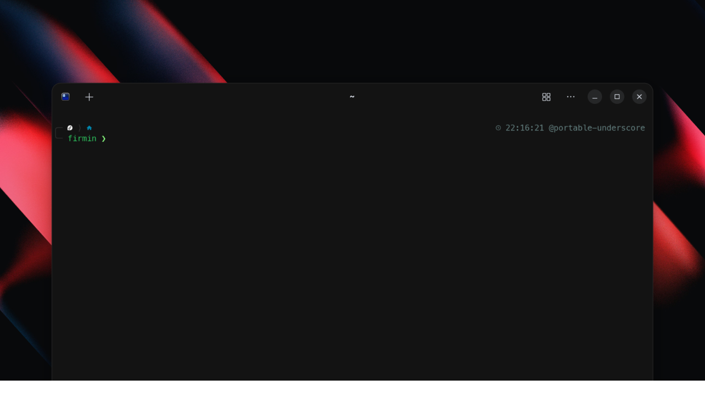

# SHELL

This is my shell configuration used on my Fedora machines using the fish shell and the ghostty terminal.

## Installation

1. Clone this repository: `git clone https://github.com/firminunderscore/shell`
2. Follow the installation script: `./installShell.sh`

## Credits

- [@Zarox28](https://github.com/Zarox28): the configuration has been stolen from him (but he's ok with that) and adapted to my needs and system.
